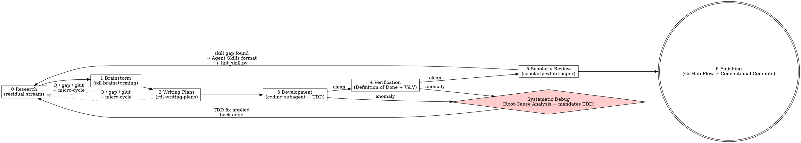

# Research Development Loop

An orchestrator skill that drives complex development tasks through a principled lifecycle. It delegates to existing named skills at each phase, maintains state machine discipline, and governs issue tracking, delegation policy, and resource safety.

**Announce at start:** "I'm using the research-development-loop skill to structure this work."

## Manifest (load first)

Before Phase 0, discover `rdloop.toml` by walking up from cwd. If absent, scaffold the
minimal non-trivial base (`rdloop/rdloop.base.toml`), write it, and pause for user review.
The manifest governs every project-specific behavior below — see `references/manifest.md`.

**Skip/prompt rule (applies to every phase and every step that shells out):** a step whose
required capability is not granted NEVER silently no-ops. If the step is **non-critical**,
log a skip naming the missing grant and continue. If the step is **critical** (the loop
cannot start or correctly continue without it), raise a **user prompt** naming the missing
capability and the exact grant that satisfies it, then halt. Never produce a false-clean.
Criticality is declared per step, not judged algorithmically.

**The ONLY valid basis for skipping is a missing capability grant.** A **missing grant** is the
sole axis on which a step may be skipped. Effort, cost, or the agent's sense that a mandated
step is "disproportionate," "overkill," or "not worth it" is **NEVER** a valid skip reason.

**Proportionality is undecidable (Rice-correct).** Triviality/effort is undecidable and MUST NOT
be auto-judged by the agent (Rice's theorem — the same principle the `rdl-brainstorming` notation
valve applies). Every mandated phase and step defaults to **in-scope and required**. Scope may be
reduced ONLY by an **explicit user assertion**, recorded as such. In the Phase 5 negative
inventory, every "deferred" item MUST cite either (a) a missing capability grant or (b) an
explicit user-asserted exception — **never agent discretion**. An item deferred on agent
discretion is a **false-clean**, and relabeling an effort judgment as a "logged skip" is the same
false-clean by another name.

## State Machine

Both anomaly back-edges land on **Phase 0 Research**, not on the phase where the anomaly surfaced. The root cause is almost never where the symptom appears — restating context from scratch surfaces assumptions that the anomaly invalidated.

---

## Phase 0: Research

Invoke `research-phase`. That skill runs steps 0.0–0.8 and produces the research residual. The residual is the canonical knowledge state for all downstream phases.

**Returns:** A research residual in K/Q/C/E/D/A/N format in the conversation thread.

**Truth-type gate:** Every K entry in the residual must carry one of four epistemic qualifiers — `[empirical]`, `[verified]`, `[sound: from K_n]`, or `[valid: from K_n]` — **and** a scope tag, `[scope: full]` or `[scope: partial — ...; see Q{n}]`. K entries missing either tag are malformed. Claims backed only by training-data recall are Q entries, not K entries. Downstream phases (brainstorm, plans, dev) may only build on K entries whose truth-type is known **and** whose scope matches the proposition they're being used to resolve.

A claim can be true, properly sourced, and even adversarially confirmed by a subagent fan-out, while still covering only a narrower slice of the question than the phase consuming it assumes — adversarial verification checks claim *accuracy*, not claim *adequacy to the calling question's scope*. Building on an unqualified K, on a `[training-recall]` claim incorrectly promoted to K, **or on a `[scope: partial]` claim treated as if it were `[scope: full]`** — is a silent failure that no test will catch; the root cause always surfaces much later as an anomaly, often only when someone with direct domain knowledge notices the gap the residual papered over.

**Research as a Service:** `research-phase` is callable from any downstream phase when an unresolved gap (⊬ P and ⊬ ¬P) or glut (⊢ P and ⊢ ¬P from conflicting streams) surfaces. Package the issue as a new Q entry and invoke `research-phase` in micro-cycle mode (steps 0.1 + 0.2 + 0.7 only).

## Phase 1: Brainstorm

Invoke `rdl-brainstorming` (a self-contained structured requirements-elicitation and
design-review gate that emits an industry-standard structured spec). Do not enter Phase 2 until
it reaches its terminal state.

**Constraint:** Do not enter Phase 2 until `rdl-brainstorming` reaches its terminal state (it invokes `rdl-writing-plans`).

**Questions during brainstorming:** If brainstorming surfaces a question, ambiguity, gap (⊬ P and ⊬ ¬P), or glut (⊢ P and ⊢ ¬P) — pause brainstorming, invoke `research-phase` in micro-cycle mode (steps 0.1 + 0.2 + 0.7 only, new Q entry as input), update the residual, then resume. Do not guess to keep brainstorming moving forward.

## Phase 2: Writing Plans

Invoke `rdl-writing-plans` (a self-contained work-breakdown + Requirements-Traceability-Matrix +
TDD plan template; adds RFC 2119 Global Constraints and AC→task→test traceability per
ISO/IEC/IEEE 29148). That skill produces the implementation plan at
`{[project].docs_dir}/plans/YYYY-MM-DD-<topic>.md`.

**Constraint:** Every task in the plan must include a TDD step (failing test written and verified before any implementation). Plans without TDD steps are incomplete — reject them and revise.

**Questions during planning:** Same rule as Phase 1 — if writing the plan exposes a dependency question, an unresolved design ambiguity, or a gap/glut in the residual, invoke `research-phase` in micro-cycle mode before continuing. Ordering questions ("do #13 before #14?") are answered by the D entries in the residual, not by guessing.

## Phase 3: Development

**Delegation decision** — apply this every task:

| Condition | Action |
|-----------|--------|
| Mechanical and well-defined | Delegate to the subagent named in `[delegation].subagent`, if its command is granted in `[capabilities].subprocess` |
| Requires multi-turn conversation history or session context | Handle inline |
| Requirements are ambiguous | Clarify first — never delegate an ambiguous task |
| Touches security constraints (POST/PATCH/DELETE to a tracker, etc.) | Handle inline — constraint enforcement requires direct oversight |
| Verification of another subagent's output | Handle inline — never chain subagents for verification |

Delegation runs `[delegation].subagent` only when granted. If `subagent = "inline"` or the
command is ungranted: mechanical tasks are handled inline (non-critical). A task that
genuinely cannot proceed inline and has no granted subagent is **critical → user prompt**.
After any delegated call, check the tool-call count; zero tool calls = delegation failed =
prerequisite-failure anomaly (surface loudly).

When the manifest-declared subagent is unavailable or the task is inline-only, develop inline
under **Test-Driven Development** (Kent Beck): write a failing test that asserts the task's
`AC-n` `SHALL` clause, run it and confirm it fails, implement the minimum to pass, run it green,
then commit. This is the same TDD discipline the plan's per-task steps encode.

End-to-end demonstrations use `[delegation].demo_runner` if granted; otherwise demonstrate
inline (non-critical, logged). Demonstrations are evidence: they either produce the expected
output (capability confirmed) or surface an anomaly (trigger systematic debugging). Claimed
capabilities without demonstration output are assertions, not evidence.

**Anomaly definition** — any of these triggers systematic debugging:
- A test failure not listed in the plan's expected-failures
- Any crash, panic, OOM, timeout, or process killed during a test or smoke run
- Exit code != 0 from any step that the plan says should succeed
- Resource exhaustion: memory, disk, rate limit, port conflict
- A PermissionDenied error (HTTP 403, EACCES, EPERM) from any external service, API, or filesystem path — the plan assumed access that does not exist; this is an architectural constraint anomaly, not a transient error to retry
- A subagent or hook producing 0 tool calls on a task that requires tool use — this indicates a model selection failure or a scope/context mismatch; the subagent cannot be assumed to have completed any work
- Any behavior that differs from the design spec
- A RuntimeWarning, DeprecationWarning, or other warning emitted during tests — warnings must be investigated to root cause, not dismissed as "correct behavior" or "informational"
- A proposed fix that treats a symptom without identifying the root cause (e.g., `pytest.importorskip` applied to suppress a collection error without finding why the dep is absent)

**On anomaly — standard path (execution started, something failed):**
1. Stop immediately — do NOT attempt a fix
2. Run a **Root-Cause Analysis** (ASQ RCA): apply **5 Whys** to a single-cause anomaly, or an
   **Ishikawa / fishbone** diagram when several causes may interact — never fix at the level of
   the immediate symptom. Then write a **failing regression test** that reproduces the root
   cause (TDD), confirm it fails, apply the minimum fix, and confirm it goes green.
3. After the root cause is found and the TDD-verified fix applied, restart at **Phase 0 Research** — the fix may invalidate design assumptions

**On anomaly — prerequisite failure (execution could not start):**

When the anomaly is a missing prerequisite that requires user action — a missing authentication token, an uninstalled dependency, access not granted, a service not running, a resource that must be created — the systematic debugging path is wrong. The root cause is already known (the prerequisite is absent). The correct response is an explicit user ask:

1. Name the specific missing prerequisite (what is absent, why it is needed, what phase or step needs it)
2. Ask the user explicitly for the action needed: "I need [specific thing] to proceed — can you [exact action]?"
3. Do NOT produce a silent return, a generic "I can't do this," or an empty completion. Silent failures leave the loop in an indeterminate state where neither the user nor the next agent knows whether work was done.

**The test for silent failure:** If a subagent returns but the task is not done and no error was surfaced, that is a silent failure — not a partial completion. Silent failures are treated as anomalies in the next phase and require systematic debugging to surface their root cause.

Coding subagent prerequisite failures that commonly require user intervention:
- Missing environment variables or API keys (coding agent cannot authenticate on its own)
- Software not installed in the test runner's environment (missing pip/conda/system package)
- Tasks out of scope for the coding agent's working directory (e.g., editing `~/.claude/skills/` from a repo-scoped agent)
- Prompt contains Claude Code UI commands (`/goal`, `/hooks`, `/config`) that the coding agent cannot interpret — the hook must surface this, not silently pass the raw slash command

## Phase 4: Verification

Apply a **Definition of Done** gate backed by **Verification & Validation** (IEEE 1012): evidence
before assertions. Run the full test suite, check every plan requirement line-by-line against the
Requirements Traceability Matrix, and verify smoke tests exit 0. Nothing is "done" until its DoD
line below is satisfied and observed.

**Verification is clean when:**
- Zero test failures **and zero collection errors** in the full suite
- Any skipped tests are explicitly named with a justified reason (not merely counted); unexplained skips are anomalies
- Zero warnings in test output — each warning investigated and either fixed or filed as an open issue
- The test runner matches the canonical runner identified in Phase 0 (`research-phase` step 0.5 test environment check); running the wrong runner produces false-clean results by silently omitting entire test files
- Every checkbox in the plan is checked
- Smoke tests (where applicable) exit 0
- No outstanding TODOs introduced by the implementation

**On anomaly:** Same rule as Phase 3 — run a Root-Cause Analysis (5 Whys / Ishikawa) and write a failing regression test before any fix, then restart at **Phase 0 Research**.

## Phase 5: Scholarly Review

Invoke `scholarly-white-paper`. This skill has a **declared toolchain requirement**: its canonical
source is DocBook 5.x XML validated by a RELAX NG (incl. RELAX NG Compact) schema and rendered via
XSLT — it needs `xmllint` (libxml2), `xsltproc` (libxslt), and `jing` (RELAX NG Compact), plus a
local DocBook RNG schema, and optionally `pdflatex` for PDF. These MUST be granted in
`[capabilities].subprocess` and present. If any required tool is ungranted or absent, apply the
skip/prompt rule: name the missing tool and the exact grant/install that satisfies it and prompt —
producing the paper's *source* is REQUIRED, but *rendering/validation* against a missing tool is a
legitimate grant-based skip (named, never silent). Apply the **honesty mandate**:

- Report capabilities and limitations with equal depth — known limitations (blocked work, resource constraints, missing dependencies) belong in the paper's limitations section, not omitted
- Deferred work is reconciled against the tracker in `[issues]`. If `tracker = "none"` or
  `gh` is ungranted, this is **non-critical → logged skip** (record the deferred item in the
  paper's limitations section instead). When granted, search before filing: iterate
  `[issues].read_repos` with `gh issue search`. File/comment only on repos in
  `[issues].write_repos`. A repo in `read_repos` but not `write_repos` is read-only by
  construction — no special-case rule needed.

  | Content | Destination |
  |---------|-------------|
  | Deferred or blocked work | Issue — search first, add comment if exists, open only if absent |
  | Known limitation | Issue + paper's limitations section (both) |
  | Architecture decision (future branches) | Spec file in `{[project].docs_dir}/specs/` |
  | Branch-specific code suggestion | PR review comment only — never a spec |

  New issue format (when no existing issue covers this):
  - Title: `<area>: <one-line description>`
  - Body: root cause discovered, blocking condition, workaround currently in effect, related file paths
  - Labels: `deferred` or `blocked` as appropriate
  - What never goes in issues: PR-level preferences, one-off build failures already fixed, duplicate reports
- Critical evaluation of each skill used is required — weaknesses and friction points count
- If gaps or failures in existing skills are found, fix them per the **Agent Skills open format**
  (agentskills.io — the open standard the chain's own skills conform to). This is the recursive
  case: the loop modifying its own skills. Determine the severity:
  - **Content gap** (missing technique, incomplete guidance, outdated step): edit the skill's
    `SKILL.md` body / `references/` — this patches the skill's content. Progressive disclosure:
    keep the frontmatter lean; push detail into `references/`.
  - **Structural problem** (wrong state machine, wrong termination condition, fundamental design
    flaw): redesign the skill's folder (SKILL.md + scripts/ + references/ + evals) from its
    requirements — patching a structurally broken skill with a content edit is symptom treatment,
    not root-cause repair.
  - **In both cases**, every edited or new `SKILL.md` MUST pass the frontmatter linter
    (`scripts/lint_skill.py`, schema `references/skill-frontmatter.schema.json`): `name` kebab-case
    ≤64 chars, `description` ≤1024 chars stating what+when. A skill edit that fails the linter is
    an anomaly (Root-Cause Analysis, not a re-save).
- A skill gap that warrants a fix is a trigger for a new R&D loop whose subject is the skill itself

**Mandatory negative inventory** — every scholarly paper must contain a named section answering all four of these questions explicitly:

1. What capabilities are claimed but NOT demonstrated by any test or demonstration run?
2. What test failures would NOT appear as failures in the test suite — conditions where the implementation silently produces wrong output without raising an exception?
3. What conditions would cause this implementation to fail before any hook fires — unsurvivable failure modes whose detection requires in-model absence tracking, not event-driven hooks?
4. What was explicitly deferred, excluded from scope, or left unverified, and why? Each deferred
   item MUST cite a missing capability grant or an explicit user-asserted exception — never agent
   discretion (see the Rice-correct proportionality rule at the top). "It seemed disproportionate"
   is a false-clean, not a deferral.

This section is not optional. A paper that omits the negative inventory has failed the honesty mandate regardless of how complete its positive claims are. The N entries from the Research Residual are the primary input to this section — they were captured at research time precisely because tests and hooks cannot see them. The absences are the part that future work, dependent implementations, and successor agents most need to know.

**The scholarly review is not a victory lap.** Passing tests confirm survivable behaviors under tested conditions. They do not confirm the absence of silent failures, resource-exhaustion modes, or untested edge cases. The negative inventory is the remedy for this structural blindness.

## Phase 6: Finishing

Integrate the branch per **GitHub Flow** (`main` is always deployable): confirm the prerequisites
below, then present the integration options — merge, open a pull request for review, or clean up.
Commit messages MUST follow **Conventional Commits 1.0.0** (`<type>[scope]: <description>`;
`feat:`/`fix:`/`docs:`/`test:`/`refactor:`/`chore:`; `BREAKING CHANGE:` in the footer for a
major). Gate every commit/PR on `[project].vcs = "git"` and the `[security].write_allowed` scope.

**Prerequisites:**
- Phase 4 verification clean (zero failures, every requirement checked)
- Phase 5 scholarly review complete and committed
- All deferred/blocked work reconciled against `[issues].write_repos` (or logged skip if `tracker = "none"`)

---

## Resource Safety

Respect `[resources]`. Never assume system RAM is free: `memory_budget_mb` is the ceiling,
and if `serialize_tasks = true`, run resource-heavy tasks in series, never in parallel.
Any subprocess that launches a server or heavy worker must be granted in
`[capabilities].subprocess`; ungranted → skip/prompt per criticality.

## Security Constraints (non-negotiable)

All writes are governed by the manifest, deny-by-default:

| Action | Allowed scope |
|--------|--------------|
| POST/PATCH/DELETE to a tracker | repos in `[issues].write_repos` only |
| GET from a tracker | repos in `[issues].read_repos` only |
| Filesystem writes / commits / PRs | paths/scopes in `[capabilities].filesystem` + `[security].write_allowed` |
| Anything unlisted | denied (`[security].default_posture = "deny"`) → skip/prompt per criticality |

A resource in a read list but absent from the corresponding write list is read-only by
construction. Any subagent result that violates these grants is discarded, not applied.

---

## Standards & reference implementations

This loop is **self-contained**: it invokes no external skill plugin as a required step and runs
to completion with the `superpowers` plugin absent. Each phase's method is an industry standard,
inlined here or in the phase sub-skill:

| Phase / step | Industry standard |
|---|---|
| 1 Brainstorm | structured requirements elicitation + design review; EARS, RFC 2119, C4/Structurizr, MADR (ISO/IEC/IEEE 29148) |
| 2 Plan | Work-Breakdown Structure + Requirements Traceability Matrix + TDD (ISO/IEC/IEEE 29148; Beck) |
| 3 Develop | Test-Driven Development (Kent Beck) |
| Debug back-edge | Root-Cause Analysis — 5 Whys / Ishikawa (ASQ) + regression test |
| 4 Verify | Definition of Done (Scrum) + Verification & Validation (IEEE 1012) |
| 5 Skill authoring | Agent Skills open format (agentskills.io) + frontmatter lint (`scripts/lint_skill.py`) |
| 6 Finish | GitHub Flow + Conventional Commits 1.0.0 |

**Reference implementations (credit, not dependency).** The Superpowers plugin skills —
`superpowers:brainstorming`, `writing-plans`, `test-driven-development`, `systematic-debugging`,
`verification-before-completion`, `finishing-a-development-branch`, `writing-skills`, and
`skill-creator:skill-creator` — are compatible reference implementations of the methods above.
Where present they MAY be used interchangeably, but the loop never requires them.

---

## Extended References (optional — critical rules are inline above)

These files contain extended detail beyond what is inline. Do not treat them as required reading — all rules needed to execute the loop are in this file.

- **[references/dependency-exploration.md](references/dependency-exploration.md)** — extended ecosystem table (17 ecosystems), SBOM parsing examples, GitHub Actions dependency-review action, formal foundations of the gap/glut distinction (Carnielli, Marcos et al.)
- **[references/hooks-architecture.md](references/hooks-architecture.md)** — hook-to-phase mapping for all 30 Claude Code hook types, watchdog crash detection pattern, structural analysis of why hooks are survival-blind
- **[references/delegation.md](references/delegation.md)** — extended task delegation guidance, stack management commands
- **[references/issue-governance.md](references/issue-governance.md)** — complete division table, subissues vs. issue comments policy, all edge cases
